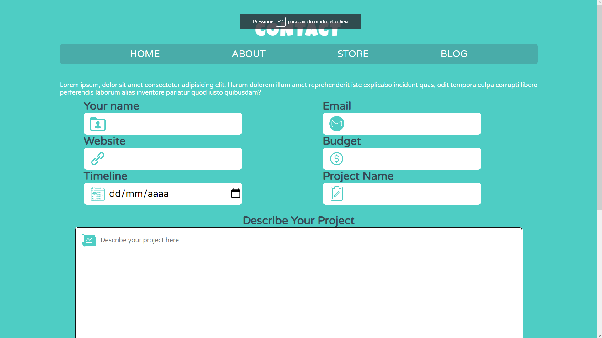
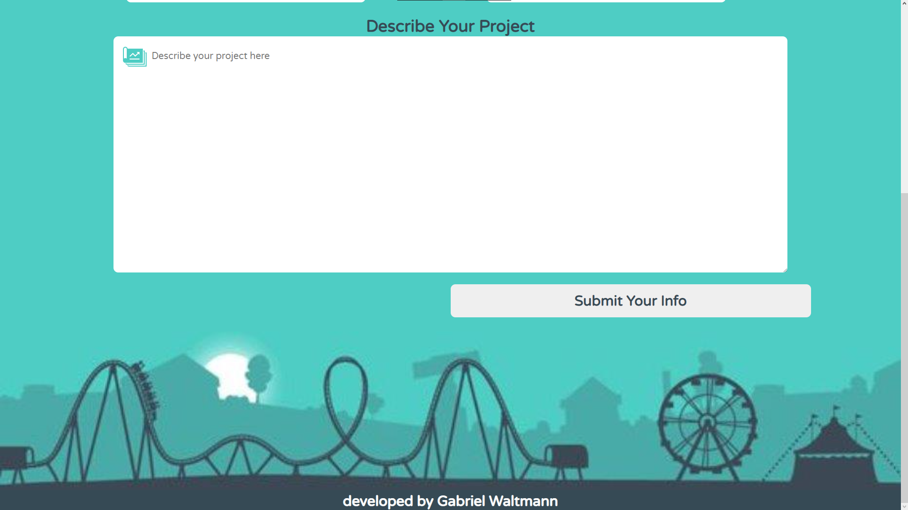

</img>

 

<h1 align="center" >Contact Form </h1>

Este é um projeto desenvolvido por mim para exercitar o uso de formulários no HTML

 

# Technologies

<table align="center">
  <tr>
    <td>HTML</td>
    <td>CSS</td>

  </tr>
  <tr>
    <td>37.9%</td>
    <td>62.1%</td>

  </tr>
</table>

# Fields <!-- Campos -->
+ Name
+ Email
+ Website
+ Budget
+ Timeline
+ Project Name
+ Description

 

# Features
- [X] Layout
- [X] Form 
- [ ] Buttons 

<figure></img></figure>
 
<figure></img></figure>

  <a href="https://gabrielwaltmann.github.io/contact/" target="_blank">
 
 </a>

# Author

 Made with by Gabriel Waltmann <a href="https://www.linkedin.com/in/gabriel-waltmann-236114232/">See my Linkedin</a>
